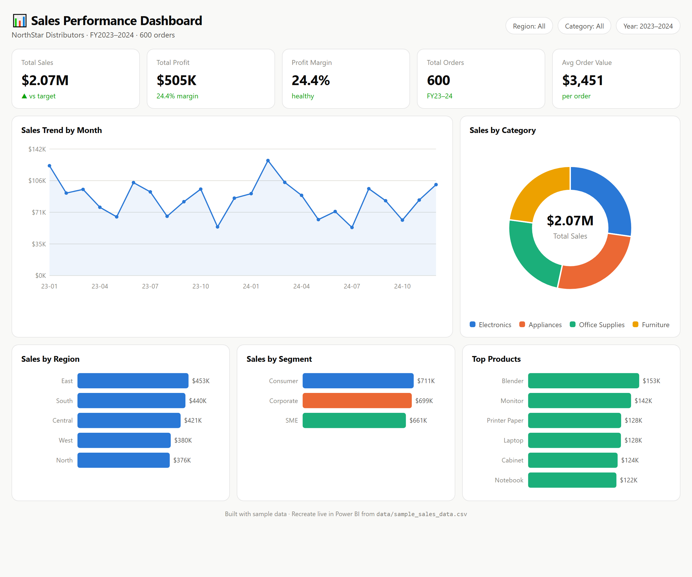

# 📊 Power BI Sales Dashboard

An interactive **Power BI** dashboard analyzing sales performance across regions, product categories, customer segments, and sales representatives — turning 600 raw transactions into decisions.

> **Author:** Hassan Khan · Technical Project Manager & BI/Business Analyst
> **Tools:** Power BI (PBIP), DAX, Power Query (M)

---

## 🖼️ Dashboard Preview



*Full interactive preview: [`preview/dashboard.html`](preview/dashboard.html) — open it in any browser.*

---

## 🎯 Business Questions Answered

- What are our **total sales, profit, and profit margin**, and how do they trend over time?
- Which **regions and segments** drive the most revenue?
- What are the **top-performing products and categories**?
- What is our **average order value**?

## 📌 Key Results (sample data)

| Metric | Value |
|--------|-------|
| Total Sales | **$2.07M** |
| Total Profit | **$505K** |
| Profit Margin | **24.4%** |
| Total Orders | **600** |
| Avg Order Value | **$3,451** |

**Insights:** The **East** region leads revenue ($453K); **Electronics** is the top category; **Consumer** is the largest segment; **Blender** and **Monitor** are the top products.

---

## 🗂️ What's in this repo

```
powerbi-sales-dashboard/
├── SalesDashboard.pbip                 ← open THIS in Power BI Desktop
├── SalesDashboard.SemanticModel/       ← data model (tables, columns, DAX measures)
│   ├── model.bim                        (600 rows embedded — no external file needed)
│   └── definition.pbism
├── SalesDashboard.Report/              ← report canvas
│   ├── report.json
│   └── definition.pbir
├── data/
│   └── sample_sales_data.csv            ← the raw dataset (600 orders, 2023–2024)
├── preview/
│   └── dashboard.html                   ← interactive HTML preview of the dashboard
└── images/
    └── dashboard-overview.png           ← dashboard screenshot
```

---

## 🚀 How to Open the Power BI Project

1. Install **Power BI Desktop** (free) and enable Preview feature **"Power BI Project (.pbip) save option"** in *File → Options → Preview features*.
2. Open **`SalesDashboard.pbip`**.
3. The data model loads automatically (the 600-row dataset is embedded in the model — no refresh or file path needed).
4. All measures are ready in the **Sales** table — drag fields onto the canvas to build visuals.

> 💡 The `.pbip` (Power BI Project) format stores the report and model as **plain text/JSON**, which is why it works beautifully with Git version control — you can see every change in a diff.

---

## 🧮 DAX Measures (already built in the model)

```dax
Total Sales     = SUM ( Sales[Sales] )
Total Profit    = SUM ( Sales[Profit] )
Profit Margin   = DIVIDE ( [Total Profit], [Total Sales] )
Total Orders    = DISTINCTCOUNT ( Sales[OrderID] )
Total Quantity  = SUM ( Sales[Quantity] )
Avg Order Value = DIVIDE ( [Total Sales], [Total Orders] )
```

## 🏗️ Build the dashboard visuals (5 minutes)

The model is ready; recreate the dashboard shown above by adding these visuals:

| Visual | Field / Measure |
|--------|-----------------|
| 5 **Card** visuals | `Total Sales`, `Total Profit`, `Profit Margin`, `Total Orders`, `Avg Order Value` |
| **Line chart** | Axis: `YearMonth` · Values: `Total Sales` |
| **Donut chart** | Legend: `Category` · Values: `Total Sales` |
| **Bar chart** | Axis: `Region` · Values: `Total Sales` |
| **Bar chart** | Axis: `Segment` · Values: `Total Sales` |
| **Bar chart** | Axis: `Product` · Values: `Total Sales` (Top N filter = 6) |
| **Slicers** | `Region`, `Category`, `Year` |

---

## 📁 Dataset

[`data/sample_sales_data.csv`](data/sample_sales_data.csv) — **600 orders (2023–2024)**:

| Column | Description |
|--------|-------------|
| `OrderID` | Unique order identifier |
| `OrderDate` | Date of the order |
| `Region` | North, South, East, West, Central |
| `Segment` | Consumer, Corporate, SME |
| `SalesRep` | Sales representative |
| `Category` / `Product` | Product classification |
| `Quantity`, `UnitPrice`, `Discount` | Order economics |
| `Sales`, `Profit` | Net sales and profit |

---

## 🛠️ Skills Demonstrated

`Power BI` · `DAX` · `Power Query (M)` · `Data Modeling` · `Data Visualization` · `PBIP / Git` · `Business Analysis`

---

<sub>⭐ Part of my data analytics portfolio. This dashboard uses generated sample data. Contact: khanhassan718@yahoo.com</sub>
